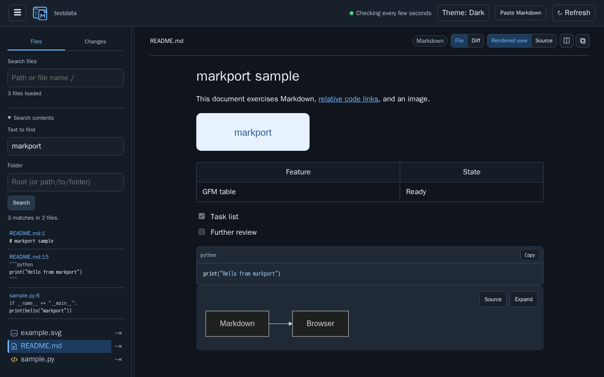
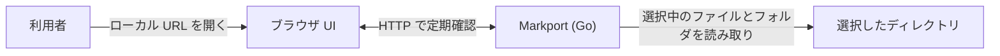

# markport

<picture>
  <source media="(prefers-color-scheme: dark)" srcset="logo/markport-logo-horizontal-dark.svg">
  
</picture>

Markport は、指定したフォルダの Markdown・HTML・コード・画像をブラウザでまとめて確認できる CLI ツールです。AI Agent が作った文書やファイルの確認にも使えます。ファイルを書き換えず、ローカルで閲覧できます。



## できること

- **ファイルを見ながらたどる：** フォルダを開き、相対リンクや画像をたどれます。Markdown の表・タスクリスト・コードの色付け・Mermaid 図、HTML と SVG・PNG・JPEG・GIF・WebP 画像のプレビューに対応します。Markdown と HTML はソース表示に切り替えられます。
- **2つのファイルを見比べる：** サイドバーのファイル横にある矢印で右側に開けます。左右は独立してスクロール・自動更新されます。**Close split** で単一表示に戻ります。狭い画面では上下に並びます。
- **必要な箇所を探す：** ファイル名・パスの検索に加え、ファイルの本文を検索して一致した行へ移動できます。
- **Git の変更を確認する：** 変更ファイルの一覧と差分を表示し、確認済みの印を付けられます。未確認のファイルだけに絞ることもできます。確認済みの印はブラウザに保存されます。
- **更新や貼り付けをすぐに確認する：** 表示中のファイルは変更を自動反映します。Markdown を貼り付けて、ファイルを作らずにプレビューすることもできます。

[Git の変更確認画面](docs/screenshots/reviewed-changes.png) · [貼り付けた Markdown のプレビュー](docs/screenshots/pasted-markdown.png)

HTML プレビューでは、指定したフォルダ内の相対パスの CSS・画像と外部 URL の CSS・画像を読み込みます。JavaScript は実行しません。

## まず使う

インストールまたは実行ファイルのダウンロード後、次のコマンドで起動します。

```sh
markport ./notes
```

起動時に表示される `http://127.0.0.1:3000/` をブラウザで開きます。フォルダを省略すると現在のディレクトリを表示します。終了するときは `Ctrl+C` を押します。

### インストールと起動

Linux では、次のスクリプトで CPU に合う最新リリースをインストールできます。

```sh
(
  installer=$(mktemp) || exit
  trap 'rm -f "$installer"' 0
  trap 'exit 1' 1 2 3 15
  curl -fsSLo "$installer" https://raw.githubusercontent.com/yomon8/markport/main/scripts/install-linux.sh &&
    sh "$installer"
)
```

導入先は `~/.local/bin/markport` で、インストーラのファイルは残りません。同じコマンドを再実行すると、古いバージョンを最新版に置き換えます。スクリプトは置き換え前にチェックサムを確認するため、ダウンロードや検証に失敗しても既存のバージョンは残ります。必要に応じて `~/.local/bin` を `PATH` に追加し、`markport ./notes` で起動してください。

GitHub Release から OS・CPU に合う実行ファイルを選びます。Linux、macOS、Windows の `amd64`（x64）と `arm64` を用意します。Windows 版は `.exe` です。利用時に Go、Node.js、npm や別置きの Web アセットは不要です。ブラウザは別途必要です。

Release の `checksums_<version>.txt` をダウンロードし、バイナリと同じフォルダで Linux は `sha256sum --check checksums_<version>.txt`、macOS は `shasum -a 256 -c checksums_<version>.txt` でハッシュを確認できます。Windows では `Get-FileHash` で個別に確認できます。

```sh
./markport_v0.2.4_linux_amd64 ./notes --port 3000
./markport_v0.2.4_linux_amd64 ./notes --host 0.0.0.0 --port 3000
./markport_v0.2.4_linux_amd64 --help
./markport_v0.2.4_linux_amd64 --version
```

既定では `127.0.0.1` でのみ待ち受けます。同じ LAN の端末から開くには `--host 0.0.0.0` を指定し、別端末で `http://<このマシンのLAN内IP>:<port>/` を開きます。`--host` には特定の IPv4 アドレスも指定できます。LAN 公開には認証と TLS がありません。ポートに接続できる人は、除外対象以外のドットファイルも含め、選択したディレクトリを閲覧できます。

`.git`、`node_modules`、`.venv` は表示から除外します。その他のドットファイルは表示します。シンボリックリンク、Windows のジャンクション、FIFO などの特殊ファイルは読みません。テキストは 10 MiB、画像は 32 MiB までです。バイナリや読めないファイルはそのファイルだけエラーを表示します。フォルダは開いたときに200件ずつ読み込みます。ファイル名検索は閲覧対象の全ファイルを対象とし、上位100件を表示します。開いたフォルダと表示中のファイルは約3秒ごとに確認し、検索中はファイル名一覧を約10秒ごとに更新します。閉じたフォルダは次に開いたときに更新します。「最新を取得」ボタンですぐに再取得できます。

クリップボードの文章を確認するには、**Paste Markdown** を押し、**Markdown Text** に貼り付けて **Rendered view** を押します。**Markdown Text** で編集画面に戻れます。通常の Markdown 機能を使えます。貼り付けた文章には基準フォルダがないため、相対リンクと画像は文字として表示します。文章は **Clear** を押すかタブを閉じるまで、再読み込み後も同じタブに残ります。再読み込み後は Markdown Text で開きます。表示のため Markport サーバーへ送信しますが、ファイルには保存しません。貼り付けられる Markdown は 1 MiB までです。

## 開発

### 構成

Go の実行ファイルが、組み込みのブラウザ UI と読み取り専用 API を指定した IPv4 アドレスで配信します。選択したファイルとフォルダを必要なときに読み込みます。



Go 1.27、Node.js 24、npm、Make を使います。devcontainer はポート 3000 と 5173 を転送します。

```sh
make setup                 # Go と npm の依存関係
make dev DIR=./testdata    # Go API と Vite 開発サーバー。Vite は localhost:5173
make build VERSION=dev     # 現在の OS・CPU 向け実行ファイル
make run DIR=./testdata PORT=3000
make run DIR=./testdata HOST=0.0.0.0 PORT=3000  # LAN からアクセス
make test                  # Go と画面のテスト
make test-e2e             # Chromium の画面受け入れテスト（Playwright のブラウザ導入が必要）
make lint                  # go vet、TypeScript、ESLint
make dist VERSION=v0.2.4  # 6 種類と SHA-256 チェックサム
```

`make setup` の後に `make lint` を単独で実行できます。画面は各 Make タスクでビルドされ、実行ファイルへ埋め込まれます。開発画面の API は Vite から Go へプロキシされます。

ブラウザの受け入れテストを初回に実行する前に、`cd web && npx playwright install --with-deps chromium` で Chromium と実行に必要なライブラリを導入します。

`v*` タグを push すると GitHub Actions が各 OS で検証してから、既存タグに対して Release を作成します。リリース実行前に `make test`、`make lint`、`make dist VERSION=<tag>` をローカルでも確認できます。コード署名と macOS の公証は初版では行いません。

現行版にファイルの編集、コメント、標準入力からの取り込み、認証付きのネットワーク公開は含めません。
