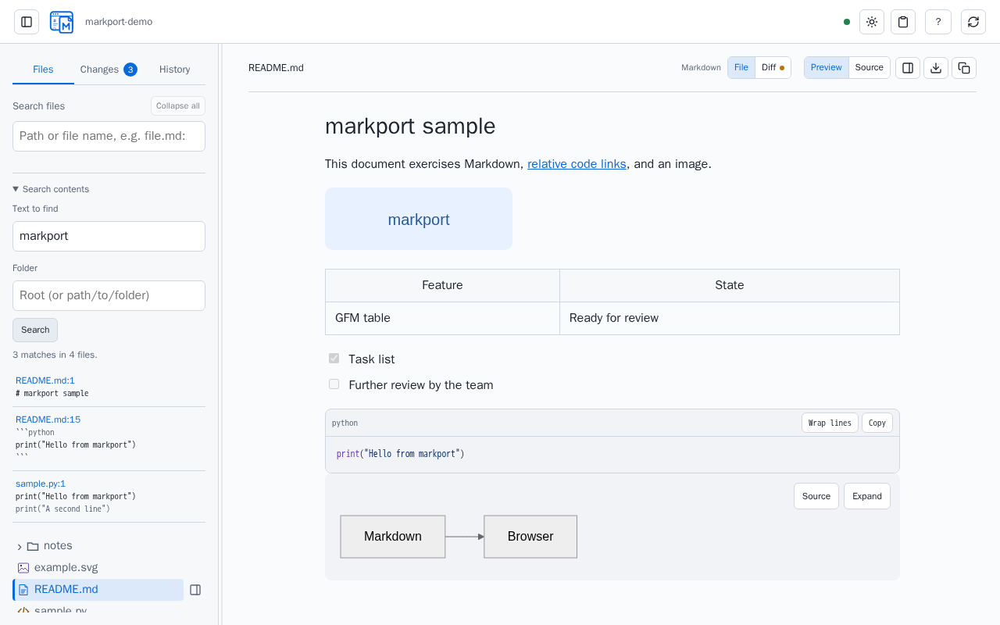

# markport

<picture>
  <source media="(prefers-color-scheme: dark)" srcset="logo/markport-logo-horizontal-dark.svg">
  
</picture>

Markport は、指定したフォルダの Markdown・HTML・コード・画像・PDF をブラウザでまとめて確認できる CLI ツールです。AI Agent が作った文書やファイルの確認にも使えます。ファイルを書き換えず、ローカルで閲覧できます。



## できること

- **ファイルを見ながらたどる：** フォルダを開き、相対リンクや画像をたどれます。Markdown の表・タスクリスト・コードの色付け・Mermaid 図・LaTeX 数式、HTML・PDF と SVG・PNG・JPEG・GIF・WebP 画像のプレビューに対応します。Markdown と HTML はソース表示に切り替えられます。PDF はブラウザ標準のビューアーで表示し、別タブで開いたりダウンロードしたりできます。
- **2つのファイルを見比べる：** サイドバーのファイル横にある矢印で右側に開けます。左右は独立してスクロール・自動更新されます。**Close split** で単一表示に戻ります。狭い画面では上下に並びます。
- **必要な箇所を探す：** ファイル名・パスの検索に加え、ファイルの本文を検索して一致した行へ移動できます。
- **Git の変更を確認する：** 変更ファイルの一覧と差分を表示し、確認済みの印を付けられます。未確認のファイルだけに絞ることもできます。確認済みの印はブラウザに保存されます。
- **Git の履歴をたどる：** サイドバーの **History** タブから、指定したフォルダ内を変更したコミットを確認できます。各コミットの変更ファイル一覧とファイルごとの差分も表示できます。
- **更新や貼り付けをすぐに確認する：** 表示中のファイルは変更を自動反映します。Markdown を貼り付けて、ファイルを作らずにプレビューすることもできます。

[Git の変更確認画面](docs/screenshots/reviewed-changes.png) · [分割表示](docs/screenshots/split-view.png) · [貼り付けた Markdown のプレビュー](docs/screenshots/pasted-markdown.png) · [ダークテーマ](docs/screenshots/content-search-dark.png) · [モバイル表示](docs/screenshots/mobile.png)

HTML プレビューでは、指定したフォルダ内の相対パスの CSS・画像と外部 URL の CSS・画像を読み込みます。JavaScript は初期状態では実行しません。信頼する HTML で **Enable JavaScript** を押すと、インラインとローカルのスクリプトによる操作や印刷を利用できます。設定はそのファイルについて現在のタブ内で保持され、**Disable JavaScript** を押すかタブを閉じるか Markport を再起動すると解除されます。スクリプトは隔離されたプレビュー内で動き、外部スクリプト、fetch・WebSocket、フォーム送信、Markport 画面へのアクセスは許可しません。

## まず使う

インストールまたは実行ファイルのダウンロード後、次のコマンドで起動します。

```sh
markport ./notes
```

起動時に表示される `http://127.0.0.1:3000/` をブラウザで開きます。フォルダを省略すると現在のディレクトリを表示します。終了するときは `Ctrl+C` を押します。

### 起動情報

ヘッダーの **Server info**（ⓘ）ボタンから、閲覧対象フォルダの絶対パス、起動時の作業ディレクトリ、起動中のMarkportのバージョン、接続先URLを確認できます。PC・モバイルともにボタンを常時表示します。例えば `markport ./notes` で起動した場合、閲覧対象は `notes` フォルダ、作業ディレクトリはコマンドを実行した場所です。閲覧対象のパスはシンボリックリンクの解決後の場所を表示します。

### カラーテーマ

ヘッダーの **Theme**（モバイルでは **App settings** 内）から **Auto**、**Light**、**Dark**、**Sepia**、**Nord** を選択できます。Auto は OS のライト／ダーク設定に追従します。Sepia は読書向けの暖色系、Nord は青灰色を基調としたダーク配色です。コードの構文色、Git 差分、Mermaid 図にもテーマが適用されます。

選択は同じホスト・ポートのブラウザに保存され、再読み込み後も復元されます。HTML プレビューは文書の配色を維持し、PDF と画像は元の見た目を保ちます。

[Sepia の画面](docs/screenshots/content-search-sepia.png) · [Nord の画面](docs/screenshots/content-search-nord.png)

### ブラウザのタブタイトル

起動時にタブタイトルを指定できます。

```sh
markport ./notes --title "作業ノート"
```

ヘッダーの **Title**（モバイルでは **App settings** 内）からも指定できます。ブラウザで保存した値は `--title` より優先し、ファイルや画面を切り替えても固定します。同じブラウザの閲覧フォルダ・接続先（ホストとポート）ごとに保存し、再読み込みやサーバー再起動後も復元します。同じ設定を使う他のタブにも変更を反映します。異なるホストやポートでは別の設定になります。

**Reset** または空欄での保存でブラウザの上書きを解除し、起動時のタイトルに戻します。どちらも未指定なら、従来どおり現在のファイル名や画面名を表示します。前後の空白は除去します。`--title=TEXT` にも対応し、空白を含むタイトルは引用符で囲んでください。

### キーボードショートカット

`?` キーまたはヘッダーのヘルプボタンで、Markport のショートカット一覧を表示できます。macOS では `Ctrl` の代わりに `⌘` を使います。

| キー | 操作 |
| --- | --- |
| `/` または `Ctrl+K` | ファイル名検索へ移動 |
| `Ctrl+B` | ファイル一覧の開閉 |
| `?` | ショートカット一覧を開く |
| `Esc` | ダイアログやメニューを閉じる |
| `n` / `p` | Diff 表示で次／前の変更ファイルへ移動 |
| `r` | 現在の変更を確認済みにし、次の未確認ファイルを開く |
| `↑` / `↓`、`Home` / `End`、`Enter` | ツリー内を移動してファイルを開く |
| `←` / `→`、`Home` / `End` | サイドバーのタブを切り替える |

入力欄での編集中や日本語入力の変換中は、グローバルショートカットは反応しません。

### インストールと起動

Linux では、次のスクリプトで CPU に合う最新リリースをインストールできます。

```sh
(
  installer=$(mktemp) || exit
  trap 'rm -f "$installer"' 0
  trap 'exit 1' 1 2 3 15
  curl -fsSLo "$installer" https://raw.githubusercontent.com/yomon8/markport/main/scripts/install-linux.sh &&
    sh "$installer"
)
```

導入先は `~/.local/bin/markport` で、インストーラのファイルは残りません。同じコマンドを再実行すると、古いバージョンを最新版に置き換えます。スクリプトは置き換え前にチェックサムを確認するため、ダウンロードや検証に失敗しても既存のバージョンは残ります。必要に応じて `~/.local/bin` を `PATH` に追加し、`markport ./notes` で起動してください。

GitHub Release から OS・CPU に合う実行ファイルを選びます。Linux、macOS、Windows の `amd64`（x64）と `arm64` を用意します。Windows 版は `.exe` です。利用時に Go、Node.js、npm や別置きの Web アセットは不要です。ブラウザは別途必要です。

Release の `checksums_<version>.txt` をダウンロードし、バイナリと同じフォルダで Linux は `sha256sum --check checksums_<version>.txt`、macOS は `shasum -a 256 -c checksums_<version>.txt` でハッシュを確認できます。Windows では `Get-FileHash` で個別に確認できます。

```sh
./markport_v0.2.7_linux_amd64 ./notes --port 3000
./markport_v0.2.7_linux_amd64 ./notes --host 0.0.0.0 --port 3000
./markport_v0.2.7_linux_amd64 --help
./markport_v0.2.7_linux_amd64 --version
```

### 更新

自己更新に対応したバージョンを導入した後は、次のコマンドを利用できます。

```sh
markport --check-update
markport --update
```

Linux・macOS・Windows の amd64／arm64 に対応します。各フラグは単独で指定し、ディレクトリ、`--host`、`--port`、`--title`、`--version` と併用しないでください。`--check-update` は現在版と最新安定版を表示し、実行ファイルのダウンロードやファイルへの書き込みは行いません。`--update` は `yomon8/markport` から新しい安定版を取得し、SHA-256 チェックサムと実行ファイルが報告するバージョンを検証して、既存のパスの実行ファイルを置き換えます。ファイル名は維持され、シンボリックリンクも引き続き更新された実行ファイルを指します。同じ版や古い版への置き換えは行いません。

更新は明示的に操作したときだけ実行し、通常起動時には確認しません。起動中の Markport サーバーで新版を使うには、手動で再起動してください。インストール先のディレクトリへの書き込み権限が必要で、管理者権限を自動で要求することはありません。`dev` や `ci` など、バージョンが `vMAJOR.MINOR.PATCH` 形式ではないビルドは、最新リリースの確認のみ可能で、自己更新を拒否します。公式リリースを手動で導入してください。このフラグを持たない旧版からは、一度インストーラまたは手動ダウンロードで導入する必要があります。

ダウンロードや検証に失敗しても、既存の実行ファイルは残ります。Windows では旧ファイルを別名に退避してから新版を配置し、配置に失敗した場合は旧版を復元します。起動中のプロセスにより旧ファイルを削除できない場合は、そのパスを表示します。旧プロセスがすべて終了した後に、退避ファイルとその一時ディレクトリを削除してください。交換中に更新プロセスを強制終了した場合、元の実行ファイルが見つからなければ、隣接する `.<実行ファイル名>-update-*` ディレクトリ内の `previous.exe` を元のパスへ戻してください。復元に失敗した場合も、復旧用のパスを表示します。更新を排他制御する小さな `.<実行ファイル名>.update.lock` ファイルはインストール先に残りますが、ロックは更新プロセスの終了時に解放されます。

終了コードは、確認成功・更新完了・更新不要が `0`、確認や更新の失敗が `1`、引数エラーが `2` です。

### LAN からのアクセス

既定では `127.0.0.1` でのみ待ち受けます。同じ LAN の端末から開くには `--host 0.0.0.0` を指定し、別端末で `http://<このマシンのLAN内IP>:<port>/` を開きます。`--host` には特定の IPv4 アドレスも指定できます。LAN 公開には認証と TLS がありません。ポートに接続できる人は、除外対象以外のドットファイルも含め、選択したディレクトリを閲覧できます。

`.git`、`node_modules`、`.venv` は表示から除外します。その他のドットファイルは表示します。シンボリックリンク、Windows のジャンクション、FIFO などの特殊ファイルは読みません。テキストは 10 MiB、画像は 32 MiB までです。バイナリや読めないファイルはそのファイルだけエラーを表示します。フォルダは開いたときに200件ずつ読み込みます。ファイル名検索は閲覧対象の全ファイルを対象とし、上位100件を表示します。開いたフォルダと表示中のファイルは約3秒ごとに確認し、検索中はファイル名一覧を約10秒ごとに更新します。閉じたフォルダは次に開いたときに更新します。「最新を取得」ボタンですぐに再取得できます。

クリップボードの文章を確認するには、**Paste Markdown** を押し、**Markdown Text** に貼り付けて **Rendered view** を押します。**Markdown Text** で編集画面に戻れます。通常の Markdown 機能を使えます。貼り付けた文章には基準フォルダがないため、相対リンクと画像は文字として表示します。文章は **Clear** を押すかタブを閉じるまで、再読み込み後も同じタブに残ります。再読み込み後は Markdown Text で開きます。表示のため Markport サーバーへ送信しますが、ファイルには保存しません。貼り付けられる Markdown は 1 MiB までです。

### LaTeX 数式

Markdown の通常表示・分割表示の両ペイン・**Paste Markdown** で、同梱の KaTeX により数式を表示します。CDN やインターネット接続は不要です。インライン数式は `$E=mc^2$` または `\(E=mc^2\)`、独立した数式は `$$E=mc^2$$` または `\[E=mc^2\]` で記述します。独立した数式は複数行にも対応します。

```markdown
$$
\int_0^1 x^2\,dx = \frac{1}{3}
$$
```

数式の内容は Markdown として解釈せず保持します。インラインコードとコードブロック内の記法はそのまま表示します。ドル記号そのものは `\$` と記述します。単一ドル記号の数式は区切りのすぐ内側に空白を入れず、閉じ区切りの直後に数字を置かないでください。Markdown の表内では、数式中の `|` を `\vert` で記述してください。

分数・積分・行列・`aligned` などの一般的な数式命令に対応します。`.tex` 文書のコンパイルや任意の LaTeX パッケージの読み込みは行いません。対応外の命令や不正な数式は元の記法とエラーを表示し、文書の他の部分は表示を続けます。HTML プレビューと `math` コードブロックはこの機能の対象外です。

## 開発

### 構成

Go の実行ファイルが、組み込みのブラウザ UI と読み取り専用 API を指定した IPv4 アドレスで配信します。選択したファイルとフォルダを必要なときに読み込みます。


```mermaid
flowchart LR
    user["利用者"] -->|"ローカル URL を開く"| browser["ブラウザ UI"]
    browser <-->|"HTTP で定期確認"| server["Markport (Go)"]
    server -->|"選択中のファイルとフォルダを読み取り"| directory["選択したディレクトリ"]
```

Go 1.27、Node.js 24、npm、Make を使います。devcontainer はポート 3000 と 5173 を転送します。

```sh
make setup                 # Go と npm の依存関係
make dev DIR=./testdata    # Go API と Vite 開発サーバー。Vite は localhost:5173
make build VERSION=dev     # 現在の OS・CPU 向け実行ファイル
make run DIR=./testdata PORT=3000
make run DIR=./testdata HOST=0.0.0.0 PORT=3000  # LAN からアクセス
make test                  # Go と画面のテスト
make test-e2e             # Chromium の画面受け入れテスト（Playwright のブラウザ導入が必要）
make screenshots            # README のスクリーンショットを再生成（Playwright ブラウザが必要）
make lint                  # go vet、TypeScript、ESLint
make dist VERSION=v0.2.7  # 6 種類と SHA-256 チェックサム
```

`make setup` の後に `make lint` を単独で実行できます。画面は各 Make タスクでビルドされ、実行ファイルへ埋め込まれます。開発画面の API は Vite から Go へプロキシされます。

ブラウザの受け入れテストを初回に実行する前に、`cd web && npx playwright install --with-deps chromium` で Chromium と実行に必要なライブラリを導入します。

`v*` タグを push すると GitHub Actions が各 OS で検証してから、既存タグに対して Release を作成します。リリース実行前に `make test`、`make lint`、`make dist VERSION=<tag>` をローカルでも確認できます。コード署名と macOS の公証は初版では行いません。

現行版にファイルの編集、コメント、標準入力からの取り込み、認証付きのネットワーク公開は含めません。
