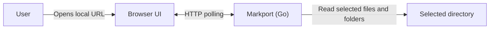

# markport

<picture>
  <source media="(prefers-color-scheme: dark)" srcset="logo/markport-logo-horizontal-dark.svg">
  
</picture>

[Read this in Japanese](README.ja.md)

Markport is a CLI for browsing Markdown, HTML, code, and images created by AI agents in a local browser. It serves a selected directory in read-only mode. It supports Markdown tables, task lists, and Mermaid diagrams; syntax highlighting for code; relative links and images; previews of HTML, SVG, PNG, JPEG, GIF, and WebP files; and automatic updates when files change. HTML previews load relative CSS and images from the selected directory and may load external CSS and images. JavaScript does not run. Use the Source button to inspect HTML code.

## Usage

On Linux, install the latest release for your CPU with the installer:

```sh
curl -fsSLo install-markport.sh https://raw.githubusercontent.com/yomon8/markport/main/scripts/install-linux.sh && sh install-markport.sh
```

It installs `markport` in `~/.local/bin`. Run the same command again to replace an older version. The installer checks the release checksum before replacing the binary, so a failed download or check leaves the installed version in place. Add `~/.local/bin` to your `PATH` if needed, then run `markport ./notes`.

Download the executable for your OS and CPU from the GitHub Releases page. Builds are available for Linux, macOS, and Windows on `amd64` (x64) and `arm64`. The Windows executable has a `.exe` extension. You do not need Go, Node.js, npm, or separate web assets to run it, but you do need a browser.

To verify a download, place `checksums_<version>.txt` from the release alongside the executable. Run `sha256sum --check checksums_<version>.txt` on Linux or `shasum -a 256 -c checksums_<version>.txt` on macOS. On Windows, use `Get-FileHash` to check an individual file.

```sh
./markport_v0.1.2_linux_amd64 ./notes --port 3000
./markport_v0.1.2_linux_amd64 ./notes --host 0.0.0.0 --port 3000
./markport_v0.1.2_linux_amd64 --help
./markport_v0.1.2_linux_amd64 --version
```

With no arguments, Markport serves the current directory on port 3000. Open the `http://127.0.0.1:<port>/` URL printed at startup. Press `Ctrl+C` to stop the server. By default, it listens only on `127.0.0.1`. To allow devices on the same LAN to connect, use `--host 0.0.0.0` and open `http://<this-machine-LAN-IP>:<port>/` on those devices. You can also bind to a specific IPv4 address with `--host`. The LAN mode has no authentication or TLS; anyone who can reach the port can browse the selected directory, including dotfiles other than the excluded directories.

Markport excludes `.git`, `node_modules`, and `.venv` from browsing. Other dotfiles remain visible. It does not read symbolic links, Windows junctions, or special files such as FIFOs. Text files are limited to 10 MiB, and image files to 32 MiB. Binary or unreadable files show an error for that file only. Folders load when opened, 200 entries at a time; filename search covers all browsable files and shows the top 100 matches. The browser checks the open folders and selected file about every three seconds, and refreshes the filename list every ten seconds while searching. Closed folders refresh when opened. Use the refresh button to fetch the latest state immediately.

## Development

### Architecture

The Go executable serves the embedded browser UI and read-only API on the configured IPv4 address. It renders files on demand and lists one folder at a time.



Development requires Go 1.27, Node.js 24, npm, and Make. The devcontainer forwards ports 3000 and 5173.

```sh
make setup                 # Download Go modules and install npm dependencies
make dev DIR=./testdata    # Start the Go API and Vite at localhost:5173
make build VERSION=dev     # Build an executable for the current OS and CPU
make run DIR=./testdata PORT=3000
make run DIR=./testdata HOST=0.0.0.0 PORT=3000  # Allow LAN access
make test                  # Run Go and UI tests
make test-e2e             # Run Chromium browser tests (requires Playwright browser setup)
make lint                  # Run go vet, TypeScript checks, and ESLint
make dist VERSION=v0.1.2  # Build six executables and SHA-256 checksums
```

After `make setup`, you can run `make lint` on its own. Each relevant Make target builds the web UI and embeds it in the executable. During development, Vite proxies API requests to Go.

Before running browser tests for the first time, install Chromium and its required libraries with `cd web && npx playwright install --with-deps chromium`.

Pushing a `v*` tag triggers GitHub Actions to validate each OS build and create a release for that tag. Before a release, you can also run `make test`, `make lint`, and `make dist VERSION=<tag>` locally. The initial release does not include code signing or macOS notarization.

The initial release does not include editing, comments, diff views, full-text search, standard-input import, or authenticated network hosting.
