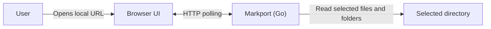

# markport

<picture>
  <source media="(prefers-color-scheme: dark)" srcset="logo/markport-logo-horizontal-dark.svg">
  
</picture>

[日本語](README.ja.md) · [Repository](https://github.com/yomon8/markport) · [Releases](https://github.com/yomon8/markport/releases)

Markport opens a folder in your browser so you can read and review Markdown, HTML, code, images, and PDFs side by side. It is handy for checking documents and files produced by AI agents. Point the CLI at a directory and Markport serves it locally — read-only, without changing any files.


## Highlights

- **Read files in context:** browse folders, follow relative links and images, and preview Markdown, HTML, PDF, SVG, PNG, JPEG, GIF, and WebP. Markdown supports tables, task lists, code highlighting, Mermaid diagrams, LaTeX math, and a table of contents. Switch Markdown or HTML to source view.
- **Compare two files:** open a second file in a split view; each pane scrolls and refreshes independently.
- **Find what you need:** search by file name or path, search text inside files, and jump straight to a line with `path/to/file.md:123`.
- **Review Git changes:** see changed files and diffs, compare against HEAD or any earlier commit, and track which files you have reviewed.
- **Browse Git history:** inspect the commits that changed the current folder and their per-file diffs.
- **Check fresh output:** open files refresh automatically as they change. Paste Markdown from the clipboard for a quick preview without creating a file.
- **Print or save as PDF:** print Markdown with rendered diagrams and formulas.
- **Single executable:** no Go, Node.js, or separate web assets needed — only a browser.

[Git review](docs/screenshots/reviewed-changes.png) · [Split view](docs/screenshots/split-view.png) · [Pasted Markdown](docs/screenshots/pasted-markdown.png) · [Dark theme](docs/screenshots/content-search-dark.png) · [Mobile layout](docs/screenshots/mobile.png)

## Contents

- [Install](#install)
- [Quick start](#quick-start)
- [Using Markport](#using-markport)
- [Updating](#updating)
- [LAN access and security](#lan-access-and-security)
- [Limits and refresh behavior](#limits-and-refresh-behavior)
- [Development](#development)

## Install

### Linux installer

Install the latest release for your CPU:

```sh
(
  installer=$(mktemp) || exit
  trap 'rm -f "$installer"' 0
  trap 'exit 1' 1 2 3 15
  curl -fsSLo "$installer" https://raw.githubusercontent.com/yomon8/markport/main/scripts/install-linux.sh &&
    sh "$installer"
)
```

The installer places `markport` in `~/.local/bin` and leaves no installer script behind. It verifies the release checksum before replacing the binary, so a failed download or check keeps the installed version. Run the same command again to upgrade. Add `~/.local/bin` to your `PATH` if needed.

### Manual download

Download the executable for your OS and CPU from the [GitHub Releases page](https://github.com/yomon8/markport/releases). Builds are available for Linux, macOS, and Windows on `amd64` (x64) and `arm64`; the Windows executable has a `.exe` extension. Release binaries are not code-signed or notarized on macOS.

To verify a download, place `checksums_<version>.txt` from the release next to the executable and run:

```sh
sha256sum --check checksums_<version>.txt      # Linux
shasum -a 256 -c checksums_<version>.txt       # macOS
```

On Windows, use `Get-FileHash` to check an individual file. On Linux and macOS, rename the downloaded file to `markport` and make it executable with `chmod +x markport`.

## Quick start

```sh
markport ./notes
```

Open the `http://127.0.0.1:3000/` URL printed at startup. Omit the directory to browse the current directory. Press `Ctrl+C` to stop.

| Option | Description |
| --- | --- |
| `[directory]` | Folder to browse. Defaults to the current directory. |
| `--host IPv4` | Address to listen on. Defaults to `127.0.0.1`. See [LAN access](#lan-access-and-security). |
| `--lan` | Alias for `--host 0.0.0.0`. Cannot be combined with `--host`. |
| `--port PORT` | Port to listen on. Defaults to `3000`. |
| `--auto-port` | Let the OS assign an available port. Cannot be combined with `--port`. |
| `--title TEXT` | Fixed browser tab title. See [Browser tab title](#browser-tab-title). |
| `--help` | Show usage. |
| `--version` | Show the version. |
| `--list-servers` | List running Markport servers for this OS user on this host. |
| `--json` | Output the server list as JSON. Requires `--list-servers`. |
| `--check-update`, `--update` | Check for or install a newer release. See [Updating](#updating). |

Options that take a value also accept the `--name=value` form, for example `--port=8080`.

To start without choosing a port, use `--auto-port` and open the URL printed at startup. The port may change each time you start Markport. Combine it with `--lan` to allow LAN access:

```sh
markport ./notes --auto-port
markport ./notes --lan --auto-port
```

## Using Markport

### File navigation and search

Click a folder in the file's breadcrumb path to reveal it in the sidebar, use **Collapse all** beside **Search files** to close all open folders, and drag the sidebar divider to adjust its width. Markdown files with three or more headings show a **Contents** outline that highlights the current section.

**Search files** matches file names and paths, including files inside closed folders. Git-ignored files remain searchable but rank below other matches. Append a positive line number, such as `path/to/file.md:123`, to jump to that line. Markdown and HTML line targets open in **Source** view.

Open **Search contents**, enter **Text to find**, and optionally set **Folder** to a path relative to the browsing directory (leave it empty to search everything). Results show matching lines with context; click one to open that line. Use **Cancel** to stop a search. If a search limit is reached, the message names the limit and notes that results are partial.

### Split view

Use the arrow beside a file in the sidebar or a search result to open it on the right. Each pane scrolls and refreshes independently. Use **Swap panes** to exchange the files, **Show this file only** to keep only the right file, or **Close split view** to return to the left file. On narrow screens the panes stack vertically.

### Code, tables, diagrams, and math

Use **Wrap lines** in a code block or source view to wrap long lines, and **Copy** to copy the code. Markdown tables have **Copy** to copy their original Markdown, plus **Wrap cells** and **Expand** for wide tables; wide tables scroll horizontally and show edge hints when more content is available. Wrapping choices are saved in this browser and apply to both split panes and pasted Markdown.

Mermaid diagrams have **Copy**, **Source**, and **Expand** controls. Copy copies the diagram definition without code fences. In the expanded view, drag to pan, use the zoom buttons or a pinch gesture to zoom, and choose **Fit diagram** or **100%** to reset the scale.

Math is rendered with bundled KaTeX, with no CDN or internet connection required, in Markdown previews, both split panes, and **Paste Markdown**. Use `$E=mc^2$` or `\(E=mc^2\)` for inline math, and `$$E=mc^2$$` or `\[E=mc^2\]` for display math, which can span multiple lines:

```markdown
$$
\int_0^1 x^2\,dx = \frac{1}{3}
$$
```

- Math contents are not parsed as Markdown; code spans and code blocks stay literal.
- Write `\$` for a literal dollar sign. Single-dollar math must have no space just inside its delimiters and no digit right after the closing `$`.
- In Markdown tables, use `\vert` instead of `|` inside formulas.
- KaTeX supports common commands such as fractions, integrals, matrices, and `aligned`. It does not compile `.tex` documents or load arbitrary packages.
- HTML previews and `math` code blocks are outside this feature.

Display formulas have **Copy** to copy their original TeX, including the `$$…$$` or `\[…\]` delimiters. If a diagram or formula cannot be rendered, its source is shown with an error and remains copyable, and the rest of the document stays readable. Code, diagram, table, formula, and expanded-view tools use icon buttons; hover over or focus a button to see its action name. Wrapping buttons are highlighted when enabled. Copy briefly shows a checkmark with **Copied**, or a cross with **Copy failed**, and announces the result to screen readers. These controls are omitted from print output.

### HTML and PDF previews

HTML previews can load relative CSS and images from the browsing directory, plus external CSS and images. JavaScript is off by default. For an HTML file you trust, click **Enable JavaScript** to run inline and local scripts, including interactive controls and printing. The choice applies to that file in the current tab until you click **Disable JavaScript**, close the tab, or restart Markport. Scripts run in an isolated preview; external scripts, fetch and WebSocket calls, form submission, and access to the Markport UI remain blocked.

PDFs use your browser's built-in viewer and can also be opened in a new tab or downloaded.

### Print and save as PDF

Choose **Print / Save as PDF** from the file actions, either split pane, or **Paste options** in Paste Markdown; it also works from Source and Text views. A dialog shows the printable document on a white background with rendered Mermaid diagrams and formulas. When it is ready, click **Print / Save as PDF** and choose **Save as PDF** in your browser's print dialog, where you can also set paper size, orientation, headers and footers, and check page breaks.

Each operation prints one document, captured when it is loaded for printing (or the current input for Paste Markdown). Rendering errors are included with a warning. Closing the dialog returns to your original view.

### Paste Markdown

Click **Paste Markdown** to open a full-size editor for Markdown that is not in a file.

- **Text** highlights Markdown while keeping its source visible, **Rendered** shows the preview, and **Split** shows both on screens at least 1200px wide, updating after a short typing pause.
- `Ctrl/Cmd+Enter` switches between Text and Rendered; `Esc` leaves the editor. Enter continues lists and tasks; `Tab` / `Shift+Tab` indent or unindent selected lines by two spaces.
- The title bar shows character and line counts and the save state. **Paste options** (⋯) offers **Clear** (with confirmation), **Copy all**, **Save as .md**, **Print / Save as PDF**, font and width settings, and opt-in **Save in this browser**.
- By default, text and caret position survive reloads in the current tab and are discarded when the tab closes. **Save in this browser** keeps text after the tab closes, so avoid it on shared devices. Reloads open in Text view.
- Input is limited to 1 MiB for saving and rendering. Above 200 KiB, highlighting pauses while plain-text editing continues.
- Relative links and images are shown as text because pasted content has no base directory. Text is sent to the Markport server for rendering but is never written to a file.

### Git review and history

Git views require Git and a browsing directory inside a Git repository. If you browse a subfolder, changes and history are limited to that folder.

**Changes** compares working files with HEAD by default, including staged, unstaged, and untracked changes. To use another base, pick a recent commit in **Compare with current from** or enter a full or abbreviated commit ID, then click **Compare**; you can also choose **Compare with current** from **History**. The commit must be reachable from HEAD, and abbreviated IDs must be unambiguous and at least seven hexadecimal characters. **Use HEAD** restores the default.

The Changes overview shows file counts, added and deleted lines, and review progress. Use **Folder tree** to group changes by directory and **Unreviewed only** to focus on remaining files. **Mark reviewed** records the current revision of a file; a later change makes it unreviewed again. Marks are saved in this browser per browsing root and comparison base. In **Diff** view, use **Previous**, **Next**, or **Review and next** (or `p`, `n`, `r`) to move through the review.

**History** lists commits that changed the current folder. Each commit's diff shows what that commit changed, while **Compare with current** compares that commit with the files on disk now.

### Server info

Click **Server info** (ⓘ) in the header or press `Ctrl+I` to see the browsing folder's absolute path (with symbolic links resolved), the working directory at startup, the Markport version, and the connection URL.

**Running Markport servers** lists servers started by the same OS user on this host, with their folders, URLs, and versions. The current server is listed first and marked **Current**. Click a folder link, or select it with `↑` / `↓` and press `Enter`, to open that server in the same tab. Use **Refresh** to update the list.

- Links work for local and direct LAN access. During LAN access, servers listening only on loopback are marked **Local access only** and have no link.
- Discovery needs servers that support this feature and share the same user cache directory and network. Other OS users, separate containers, reverse proxies, and tunnels are not supported.
- Records are stored under `markport/instances` in the OS user cache directory (never in the browsed folder) and removed on normal shutdown. Stopped servers are filtered out by a live check. If discovery fails, the current server's details are still shown along with the error.

You can also retrieve the list from the CLI without starting a server:

```sh
markport --list-servers
markport --list-servers --json
```

The default output is a table with `URL`, `VERSION`, and `DIRECTORY` columns. JSON output is an array of objects:

```json
[{"rootPath":"/home/user/notes","url":"http://127.0.0.1:3000/","version":"v0.11.0"}]
```

Both formats sort servers by browsing directory, port, and URL. CLI URLs connect from this machine; servers listening on `0.0.0.0` use `127.0.0.1` in the URL. With no running servers, the command prints `No running Markport servers found.` (or `[]` with `--json`) and exits successfully. Discovery failures are reported on standard error with exit code `1`, without printing a partial list. `--list-servers` cannot be combined with a directory, startup options, update flags, or `--version`.

### Color themes

Choose **Theme** in the header (under **App settings** on mobile):

| Theme | Look |
| --- | --- |
| Auto | Follows your OS light/dark preference |
| Light / Dark | Default palettes |
| Sepia | Warm colors for reading |
| Nord | Dark blue-gray |
| Catppuccin Mocha | Pastel accents on a dark background |
| Solarized Light | Cream and teal |
| Rosé Pine Dawn | Warm paper tones |
| Tokyo Night | Deep blue with purple and blue accents |
| Tokyo Night Light | Cool gray with blue and purple accents |

Themes also apply to code highlighting, Git diffs, and Mermaid diagrams. HTML previews keep the document's own colors; PDFs and images keep their original appearance. The choice is saved in this browser per host and port.

[Sepia](docs/screenshots/content-search-sepia.png) · [Nord](docs/screenshots/content-search-nord.png)

### Browser tab title

Set a fixed tab title at startup:

```sh
markport ./notes --title "Work notes"
```

You can also set **Title** in the header (under **App settings** on mobile). A title saved in the browser overrides `--title`, stays fixed while you switch files, and is saved per browsing folder and host/port. Changes apply to other open tabs using the same setting and survive reloads and server restarts. Use **Reset** or save an empty value to fall back to the startup title; with neither set, the tab shows the current file or screen name.

### Keyboard shortcuts

Press `?` or the help button in the header to see shortcuts in Markport. On macOS, use `⌘` instead of `Ctrl`.

| Keys | Action |
| --- | --- |
| `/` or `Ctrl+K` | Focus file search |
| `Ctrl+B` | Toggle the file list |
| `Ctrl+I` | Open Server info |
| `?` | Show keyboard shortcuts |
| `Esc` | Close a dialog or menu; clear file search |
| `n` / `p` | Next / previous changed file in Diff view |
| `r` | Mark reviewed and open the next unreviewed file |
| `↑` / `↓`, `Home` / `End`, `Enter` | Move through and open items in the file tree |
| `←` / `→`, `Home` / `End` | Switch sidebar tabs |
| `↑` / `↓`, `Enter` | Select and open a running server in Server info |
| `Ctrl+Enter`, `Tab` / `Shift+Tab`, `Esc` | Switch views, indent, and leave the editor in Paste Markdown |

Global shortcuts do not interrupt text entry or IME composition.

## Updating

Versions that support self-update can update themselves:

```sh
markport --check-update   # Show the current and latest stable versions
markport --update         # Download, verify, and install a newer stable release
```

- Supported on Linux, macOS, and Windows (amd64 and arm64). Use each flag on its own, without a directory or other options.
- `--check-update` does not download an executable or write files.
- `--update` downloads a newer stable release from `yomon8/markport`, verifies its SHA-256 checksum and reported version, and replaces the executable in place. The file name is preserved and symbolic links keep pointing to it. Equal or older releases are not installed.
- Markport never checks for updates on normal startup. Restart running servers manually to use the new version.
- The installation directory must be writable; Markport does not request administrator privileges.
- Builds whose version is not `vMAJOR.MINOR.PATCH` (such as `dev` or `ci`) can check but not self-update. Versions without these flags need one manual install or a run of the installer first.
- Exit codes: `0` for a successful check, completed update, or no newer version; `1` for a failure; `2` for invalid arguments.

<details>
<summary>Failure recovery details</summary>

Download and verification failures leave the installed executable in place. On Windows, the old executable is renamed before the new one is installed, and a failed installation attempts to restore it. If a running process prevents deletion of the previous executable, its path is printed so you can remove it and its staging directory after all old processes exit. If the update is forcibly terminated during replacement and the original path is missing, move `previous.exe` from the adjacent `.<executable>-update-*` directory back to the original path. A failed restore reports the recovery paths. The small `.<executable>.update.lock` file stays in the installation directory to coordinate updates; its lock is released when the updater exits.

</details>

## LAN access and security

By default, Markport listens only on `127.0.0.1`. To let devices on the same LAN connect, start it with `--lan`, `--host 0.0.0.0`, or a specific IPv4 address and open `http://<this-machine-LAN-IP>:<port>/` on those devices:

```sh
markport ./notes --lan --port 3000
```

> [!WARNING]
> LAN mode has no authentication or TLS. Anyone who can reach the port can browse the selected directory, including dotfiles other than the excluded directories.

## Limits and refresh behavior

- `.git`, `node_modules`, and `.venv` are excluded from browsing; other dotfiles are visible.
- Symbolic links, Windows junctions, and special files such as FIFOs are not read.
- Text files are limited to 10 MiB and images to 32 MiB. Binary or unreadable files show an error for that file only.
- Folders load when opened, 200 entries at a time. File search covers all browsable files and shows the top 100 matches.
- Open folders and the selected file are checked about every three seconds, and the file name list refreshes every ten seconds while searching. Closed folders refresh when opened. Click **Refresh** in the header to fetch the latest state immediately.

Markport does not edit files, add comments, read from standard input, or provide authenticated network hosting.

## Development

### Architecture

The Go executable serves the embedded browser UI and a read-only API on the configured IPv4 address. It renders files on demand and lists one folder at a time.


```mermaid
flowchart LR
    user["User"] -->|"Opens local URL"| browser["Browser UI"]
    browser <-->|"HTTP polling"| server["Markport (Go)"]
    server -->|"Read selected files and folders"| directory["Selected directory"]
```

| Path | Role |
| --- | --- |
| `cmd/markport/` | Entry point |
| `internal/cli/` | Argument parsing |
| `internal/files/` | Safe filesystem access and watching |
| `internal/render/` | HTML rendering |
| `internal/server/` | HTTP server |
| `internal/gitdiff/` | Git changes and history |
| `internal/discovery/` | Running server discovery |
| `internal/update/` | Self-update |
| `web/src/` | TypeScript UI and CSS (built into `internal/web/dist/`) |
| `testdata/` | Sample content for browsing |

### Commands

Development requires Go 1.27, Node.js 24, npm, and Make. The devcontainer forwards ports 3000 and 5173.

```sh
make setup                 # Download Go modules and install npm dependencies
make dev DIR=./testdata    # Start the Go API and Vite at localhost:5173
make build VERSION=dev     # Build an executable for the current OS and CPU
make run DIR=./testdata PORT=3000
make run DIR=./testdata HOST=0.0.0.0 PORT=3000  # Allow LAN access
make test                  # Run Go and UI tests
make test-e2e              # Run Chromium browser tests
make screenshots           # Regenerate the README screenshots
make lint                  # Run go vet, TypeScript checks, and ESLint
make dist VERSION=v1.0.0   # Build six executables and SHA-256 checksums
```

After `make setup`, you can run `make lint` on its own. Each relevant Make target builds the web UI and embeds it in the executable. During development, Vite proxies API requests to Go. Before running `make test-e2e` or `make screenshots` for the first time, install Chromium and its libraries with `cd web && npx playwright install --with-deps chromium`.

### CI and releases

Pull requests run CI on Linux, macOS, and Windows, with Chromium browser tests on Linux; ordinary branch pushes do not run CI. Pushing a `v*` tag makes GitHub Actions validate each OS build and create a release for that tag. Before releasing, you can run `make test`, `make lint`, `make test-e2e VERSION=<tag>`, and `make dist VERSION=<tag>` locally.

Commit messages follow [Conventional Commits](https://www.conventionalcommits.org/).
