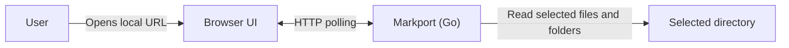

# markport

<picture>
  <source media="(prefers-color-scheme: dark)" srcset="logo/markport-logo-horizontal-dark.svg">
  
</picture>

[Read this in Japanese](README.ja.md)

Markport opens a folder in your browser so you can read and review Markdown, HTML, code, images, and PDFs together. It is useful for checking documents and files created by AI agents. Point the CLI at a directory; Markport serves it locally without changing its files.


## What you can do

- **Read files in context:** browse folders, follow relative links and images, and preview Markdown, HTML, PDF, SVG, PNG, JPEG, GIF, and WebP. Markdown supports tables, task lists, code highlighting, Mermaid diagrams, and LaTeX math. Switch to source view for Markdown or HTML. PDFs use your browser's built-in viewer and can also be opened in a new tab or downloaded.
- **Compare two files:** use the arrow beside a file in the sidebar to open it on the right. Each pane scrolls and refreshes independently; **Close split** returns to one file. On narrow screens the panes stack vertically.
- **Find what you need:** search by file name or path, or search text inside files and jump to matching lines. In **Search files**, enter `path/to/file.md:123` to open line 123, including in the right pane. Markdown and HTML open in source view when a line is specified.
- **Review Git changes:** see changed files and their diffs, compare current files with HEAD or a selected commit, mark each revision as reviewed, and filter to unreviewed files. Review marks are kept in this browser.
- **Browse Git history:** open the History tab to inspect commits that changed the selected folder, then view each commit's files and per-file diff.
- **Check fresh output:** open files refresh automatically as they change. Paste Markdown from your clipboard for a quick preview without creating a file.

[See the Git review screen](docs/screenshots/reviewed-changes.png) · [See the split view](docs/screenshots/split-view.png) · [See the pasted Markdown preview](docs/screenshots/pasted-markdown.png) · [See the dark theme](docs/screenshots/content-search-dark.png) · [See the mobile layout](docs/screenshots/mobile.png)

HTML previews can load relative CSS and images from the selected directory, plus external CSS and images. JavaScript is off by default. For an HTML file you trust, click **Enable JavaScript** to run inline and local scripts, including interactive controls and printing. The choice applies to that file in the current browser tab until you disable it, close the tab, or restart Markport. Scripts run in an isolated preview; external scripts, fetch and WebSocket calls, forms, and access to the Markport UI remain blocked.

## Get started

After installing or downloading the executable, run:

```sh
markport ./notes
```

Open the `http://127.0.0.1:3000/` URL printed at startup. Omit the directory to browse the current directory. Press `Ctrl+C` to stop Markport.

### Server info

Click the **Server info** (ⓘ) button in the header to check the browsed folder's absolute path, working directory at startup, running Markport version, and connection URL. The button is always available on desktop and mobile. For example, when you run `markport ./notes`, the browsing directory is the `notes` folder and the working directory is where you ran the command. The browsing path resolves symbolic links.

### Color themes

Use **Theme** in the header (under **App settings** on mobile) to choose **Auto**, **Light**, **Dark**, **Sepia**, or **Nord**. Auto follows your operating system's light/dark preference. Sepia uses warm colors for reading; Nord uses a dark blue-gray palette. Themes also apply to code highlighting, Git diffs, and Mermaid diagrams.

The choice is saved in this browser for the same host and port and restored after reloads. HTML previews keep the document's colors; PDFs and images keep their original appearance.

[See Sepia](docs/screenshots/content-search-sepia.png) · [See Nord](docs/screenshots/content-search-nord.png)

### Browser tab title

Set a fixed browser tab title at startup:

```sh
markport ./notes --title "Work notes"
```

You can also use **Title** in the header (under **App settings** on mobile). A title saved in the browser overrides `--title` and stays fixed when switching files or views. It is saved separately for each browsed folder and connection (host and port) in that browser, and restored after reloads and server restarts. Changes also apply to other open tabs using the same setting. Another host or port has separate settings.

Use **Reset** or save an empty field to remove the browser override and use the startup title. If neither is set, the tab shows the current file or screen name as before. Surrounding whitespace is removed. `--title=TEXT` is also supported; quote titles containing spaces.

### Keyboard shortcuts

Press `?` or the help button in the header to see these shortcuts in Markport. On macOS, use `⌘` instead of `Ctrl`.

| Keys | Action |
| --- | --- |
| `/` or `Ctrl+K` | Focus file search |
| `Ctrl+B` | Toggle the file list |
| `?` | Open the shortcut list |
| `Esc` | Close a dialog or menu |
| `n` / `p` | Next / previous changed file in Diff view |
| `r` | Mark the current change reviewed and open the next unreviewed file |
| `↑` / `↓`, `Home` / `End`, `Enter` | Move through and open files in the tree |
| `←` / `→`, `Home` / `End` | Switch or select sidebar tabs |

Global shortcuts do not interrupt text entry or IME composition.

### Install and run

On Linux, install the latest release for your CPU with the installer:

```sh
(
  installer=$(mktemp) || exit
  trap 'rm -f "$installer"' 0
  trap 'exit 1' 1 2 3 15
  curl -fsSLo "$installer" https://raw.githubusercontent.com/yomon8/markport/main/scripts/install-linux.sh &&
    sh "$installer"
)
```

It installs `markport` in `~/.local/bin` without leaving an installer script behind. Run the same command again to replace an older version. The installer checks the release checksum before replacing the binary, so a failed download or check leaves the installed version in place. Add `~/.local/bin` to your `PATH` if needed, then run `markport ./notes`.

Download the executable for your OS and CPU from the GitHub Releases page. Builds are available for Linux, macOS, and Windows on `amd64` (x64) and `arm64`. The Windows executable has a `.exe` extension. You do not need Go, Node.js, npm, or separate web assets to run it, but you do need a browser.

To verify a download, place `checksums_<version>.txt` from the release alongside the executable. Run `sha256sum --check checksums_<version>.txt` on Linux or `shasum -a 256 -c checksums_<version>.txt` on macOS. On Windows, use `Get-FileHash` to check an individual file.

```sh
./markport_v0.2.7_linux_amd64 ./notes --port 3000
./markport_v0.2.7_linux_amd64 ./notes --host 0.0.0.0 --port 3000
./markport_v0.2.7_linux_amd64 --help
./markport_v0.2.7_linux_amd64 --version
```

### Updating

After installing a version that supports self-update, use:

```sh
markport --check-update
markport --update
```

These commands support Linux, macOS, and Windows on amd64 and arm64. Use each flag on its own, without a directory, `--host`, `--port`, `--title`, or `--version`. `--check-update` reports the current and latest stable versions without downloading an executable or writing files. `--update` downloads a newer stable release from `yomon8/markport`, verifies its SHA-256 checksum and reported version, and replaces the executable at its existing path. The file name is preserved, and symbolic links continue to point to the updated executable. Equal or older releases are not installed.

Updates run only when requested; normal startup does not check for updates. Restart any running Markport servers manually to use the new version. The installation directory must be writable; Markport does not automatically request administrator privileges. Builds whose version is not `vMAJOR.MINOR.PATCH`, including `dev` and `ci`, can check the latest release but cannot self-update. Install an official release manually instead. Older versions without these flags need the installer or a manual download once before using self-update.

Download and verification failures leave the installed executable in place. On Windows, the old executable is renamed before installing the new one; a failed installation attempts to restore it. If a running process prevents deletion of the previous executable, its path is printed so you can remove it and its containing staging directory after all old processes exit. If the update is forcibly terminated during replacement, look for `previous.exe` in the adjacent `.<executable>-update-*` directory and move it back to the original path if that path is missing. A failed restore reports the recovery paths. The small `.<executable>.update.lock` file remains in the installation directory to coordinate updates; its lock is released when the updater exits.

Exit codes are `0` for a successful check, completed update, or no newer version; `1` for a check or update failure; and `2` for invalid arguments.

### LAN access

By default, Markport listens only on `127.0.0.1`. To allow devices on the same LAN to connect, use `--host 0.0.0.0` and open `http://<this-machine-LAN-IP>:<port>/` on those devices. You can also bind to a specific IPv4 address with `--host`. The LAN mode has no authentication or TLS; anyone who can reach the port can browse the selected directory, including dotfiles other than the excluded directories.

Markport excludes `.git`, `node_modules`, and `.venv` from browsing. Other dotfiles remain visible. It does not read symbolic links, Windows junctions, or special files such as FIFOs. Text files are limited to 10 MiB, and image files to 32 MiB. Binary or unreadable files show an error for that file only. Folders load when opened, 200 entries at a time; filename search covers all browsable files and shows the top 100 matches. The browser checks the open folders and selected file about every three seconds, and refreshes the filename list every ten seconds while searching. Closed folders refresh when opened. Use the refresh button to fetch the latest state immediately.

To preview text from the clipboard, click **Paste Markdown**, paste into **Markdown Text**, then click **Rendered view**. Use **Markdown Text** to return to the editable text. The preview supports the usual Markdown features. Relative links and images are shown as text because pasted content has no base directory. The text stays in the current browser tab through reloads until you click **Clear** or close the tab; after a reload, it opens in Markdown Text. It is sent to the Markport server for rendering but is not saved to a file. Pasted Markdown is limited to 1 MiB.

### LaTeX math

Markdown previews, both split panes, and **Paste Markdown** render math with bundled KaTeX, without a CDN or internet connection. Use `$E=mc^2$` or `\(E=mc^2\)` for inline math, and `$$E=mc^2$$` or `\[E=mc^2\]` for display math. Display math can also span multiple lines:

```markdown
$$
\int_0^1 x^2\,dx = \frac{1}{3}
$$
```

Math contents are preserved rather than parsed as Markdown. Code spans and code blocks remain literal. Write `\$` for a literal dollar sign; single-dollar math must have no space immediately inside its delimiters and no digit immediately after its closing delimiter. In Markdown tables, use `\vert` rather than a literal `|` inside formulas.

KaTeX supports common math commands such as fractions, integrals, matrices, and `aligned`; it does not compile `.tex` documents or load arbitrary LaTeX packages. Unsupported commands and invalid formulas show their original source with an error, while the rest of the document remains readable. HTML previews and `math` code blocks are outside this feature.

## Development

### Architecture

The Go executable serves the embedded browser UI and read-only API on the configured IPv4 address. It renders files on demand and lists one folder at a time.


```mermaid
flowchart LR
    user["User"] -->|"Opens local URL"| browser["Browser UI"]
    browser <-->|"HTTP polling"| server["Markport (Go)"]
    server -->|"Read selected files and folders"| directory["Selected directory"]
```

Development requires Go 1.27, Node.js 24, npm, and Make. The devcontainer forwards ports 3000 and 5173.

```sh
make setup                 # Download Go modules and install npm dependencies
make dev DIR=./testdata    # Start the Go API and Vite at localhost:5173
make build VERSION=dev     # Build an executable for the current OS and CPU
make run DIR=./testdata PORT=3000
make run DIR=./testdata HOST=0.0.0.0 PORT=3000  # Allow LAN access
make test                  # Run Go and UI tests
make test-e2e             # Run Chromium browser tests (requires Playwright browser setup)
make screenshots            # Regenerate the README screenshots (requires Playwright browser setup)
make lint                  # Run go vet, TypeScript checks, and ESLint
make dist VERSION=v0.2.7  # Build six executables and SHA-256 checksums
```

After `make setup`, you can run `make lint` on its own. Each relevant Make target builds the web UI and embeds it in the executable. During development, Vite proxies API requests to Go.

Before running browser tests for the first time, install Chromium and its required libraries with `cd web && npx playwright install --with-deps chromium`.

Pushing a `v*` tag triggers GitHub Actions to validate each OS build and create a release for that tag. Before a release, you can also run `make test`, `make lint`, and `make dist VERSION=<tag>` locally. The initial release does not include code signing or macOS notarization.

Current releases do not include editing files, comments, standard-input import, or authenticated network hosting.
