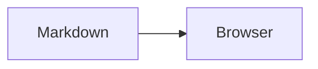

# markport sample

This document exercises **Markdown**, [relative code links](sample.py), and an image.


| Feature | State |
| --- | --- |
| GFM table | Ready |

- [x] Task list
- [ ] Further review

```python
print("Hello from markport")
```


